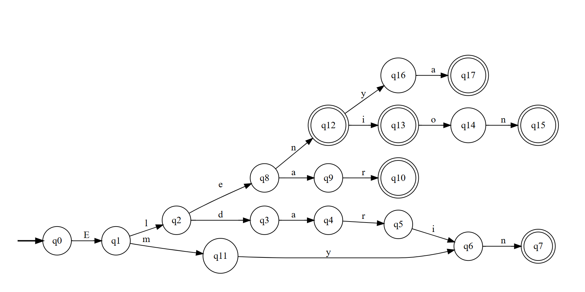
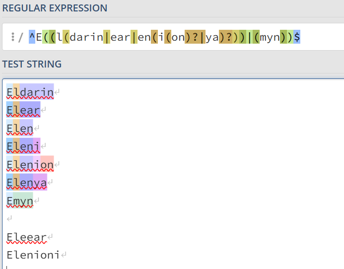

# Implementation-of-Computational-Methods
## Description
During this Evidence, I have been using the language “Quenya,” which is an elvish language that is part of the branch ‘Aman.’ Quenya was typically written with the Tengwar of Fëanor, a writing structure that nowadays resembles Arabic or Hindi traces in their words. There is information of two different dialects coming for Quenya, which are Valinorean Quenya and Vanyarin Quenya; spoken by two different clans of the Aman, the Noldor and the Vanyar. It has a Latin-like phonology, also having the same 5 vowels that we have in most Latin languages nowadays. Even though it can give an idea of most Romance languages, it is more influenced by Finnish; some of the language rules are presented in the Elvish structure. The word Quenya means “belonging to the Quendi”, however, the meaning does not delimit the language to just be spoken in certain places.  (Lambenor, n.d.)

The objective is to create a program that only recognizes the words that have been assigned to me with Quenya. The words are:
Eldarin
Elear
Elen
Eleni
Elenion
Elenya
Emyn

For the automata, I have been using a DFA (Deterministic Finite Automata), which is more rigid because it only transitions to one state, only one. It doesn't allow any null transitions, all of the transitions must be defined. Used this one to have a more exact model, and avoid having something confusing. (GeeksforGeeks, n.d.)

## Model of Solution
The automata generated ended up being this one:

It takes all the different routes the letters of the words can be. It is built that way, so other words with extra letters or in different order are not accepted. 
The representation in each case is:
Eldarin: q0 -> q1 -> q2 -> q3 -> q4 -> q5 -> q6 -> q7
Elear: q0 -> q1 -> q2 -> q8 -> q9 -> q10
Elen: q0 -> q1 -> q2 -> q8 -> q12 
Eleni: q0 -> q1 -> q2 -> q8 -> q12 -> q13
Elenion: q0 -> q1 -> q2 -> q8 -> q12 -> q13 -> q14 -> q15
Elenya: q0 -> q1 -> q2 ->q8 -> q12 -> q16 -> q17
Emyn: q0 -> q1 -> q11 -> q6 -> q7

## Implementation
For my lexical analysis and used the regular expressión in the file regexp.py. In the file, if you give them the words of the list it should return a yes, but if the word is slightly different it should be a no.

Elear -> Yes
Eleni -> Yes
Elenya -> Yes
Eleear  -> No
Elenioni  -> No

The regular expression is written like this;

^E((l(darin|ear|en(i(on)?|ya)?))|(myn))$

^ = asserts a position at the start of the line
$ = asserts a position at the end of the line

And using Regex101.com I checked if it worked or not.

## Tests
The file tests_regexp.py has all the cases tested for regular expressions. It includes 20 tests, of which only 7 are valid, and will pass. If the word entered in the py file is incorrect, the test will not appear.

## Prolog
I also tried to do it in Prolog. Using an array, and searching letter by letter to see if it fits or not. Searching first with the head, and it continues, going for the tail until the word is complete.

% Valid words
words(["eldarin", "elear", "elen", "eleni", "elenion", "elenya", "emyn"]).

% Rule to check if a word is in the list
is_valid(W) :-  
    words(L),  
    search(W, L).

% Rule search for the word going to each letter of the word
search(H, [H|_]).  % If the head of the list is the searched word, it is valid.
search(H, [_|T]) :- search(H, T). % Otherwise, continue searching in the tail.

## Analysis
Starting with the time complexity, the main factor to use is the behavior of the function of the library re (for regular expressions), which is re.match(). Using a DFA with a linear runtime means that I didn’t use any kind of repetition with the symbols * or + in my regex. That leads to the conclusion that the time can be in **O(n)**.

If we go with the cases that do not match, like just using an “E” it terminates ins **O(1)**. While in any other length of the sting, it goes to **O(n)**. The complexity is not more complex because the code does not have any kind of loops into other loops or something that can make it more complex.

## References
Lambenor. (n.d.). Quenya. http://lambenor.free.fr/ardalambion/quenya.html 

Tolkien Gateway. (n.d.). Quenya. https://tolkiengateway.net/wiki/Quenya 

GeeksforGeeks. (n.d.). Introduction of finite automata. https://www.geeksforgeeks.org/introduction-of-finite-automata/ 
